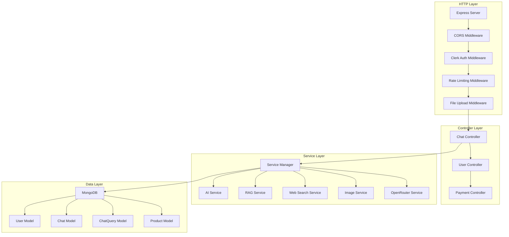

# QueryNox Backend - Technical Architecture Documentation

## System Overview

QueryNox is a production-grade, multi-model AI chat platform engineered with a sophisticated microservices-inspired architecture. The system integrates 8+ AI providers, implements real-time web search augmentation, advanced document processing through RAG (Retrieval-Augmented Generation), subscription-based rate limiting, comprehensive monitoring, and enterprise-level security features.

## Technical Stack

### Core Framework & Infrastructure
- **Runtime**: Node.js 18+ (Event-driven, non-blocking I/O)
- **Web Framework**: Express.js 4.18.2 with custom middleware pipeline
- **Database**: MongoDB 8.0.1 with Mongoose ODM (Atlas/Self-hosted)
- **Process Manager**: Docker Compose for containerized deployments
- **File Storage**: Cloudflare R2 (S3-compatible) for image artifacts

### Authentication & Authorization
- **Primary Auth**: Clerk Authentication with JWT validation
- **Secondary Auth**: Basic HTTP Authentication for admin endpoints
- **Session Management**: Stateless JWT with user context hydration

### Monitoring & Observability
- **Metrics**: Prometheus with custom metrics collection
- **Logging**: Winston + Grafana Loki (structured JSON logging)
- **Visualization**: Grafana dashboards for real-time monitoring
- **Performance Tracking**: Custom request/response time histograms

### AI Provider Integrations
- **Primary**: OpenAI (GPT models, DALL-E, Embeddings)
- **Anthropic**: Claude 3.5 Sonnet via native SDK
- **Groq**: Llama 3.3-70B with hardware acceleration
- **Google**: Gemini 1.5 Flash via GenerativeAI SDK
- **OpenRouter**: Unified proxy for gpt-oss-120b, Grok-3-mini
- **Embedding**: OpenAI text-embedding-3-small (1536 dimensions)

## Architecture Deep Dive

### Service Layer Architecture



### Database Schema Design

#### User Document Structure
```javascript
{
  _id: String,                    // Clerk User ID (primary key)
  chats: [ObjectId],             // Array of chat references
  bookmarkedChats: [ObjectId],   // Bookmarked chat references
  productId: String,             // Subscription product reference
  usedChatGeneration: Number,    // Monthly usage counter
  usedImageGeneration: Number,   // Monthly image generation counter
  usedWebSearch: Number,         // Monthly web search counter
  usedFileRag: Number,           // Monthly RAG usage counter
  limitsUpdatedAt: Number,       // Last reset timestamp
  createdAt: Number,             // Account creation timestamp
  updatedAt: Number              // Last modification timestamp
}
```

#### Chat Document Structure
```javascript
{
  _id: ObjectId,                 // Auto-generated chat ID
  userId: String,                // User reference (Clerk ID)
  title: String,                 // Auto-generated chat title
  chatName: String,              // AI-generated descriptive name
  model: String,                 // Current model being used
  systemPrompt: String,          // System instructions
  webSearch: Boolean,            // Web search enabled flag
  isShared: Boolean,             // Public sharing flag
  createdAt: Number,             // Chat creation timestamp
  updatedAt: Number              // Last activity timestamp
}
```

#### ChatQuery Document Structure
```javascript
{
  _id: ObjectId,                 // Auto-generated query ID
  chatId: ObjectId,              // Parent chat reference
  prompt: String,                // User input prompt
  model: String,                 // Model used for response
  systemPrompt: String,          // System prompt at time of query
  webSearch: Boolean,            // Web search used flag
  response: String,              // AI model response
  meta: Map<String, String>,     // Metadata (image keys, etc.)
  createdAt: Number,             // Query timestamp
  updatedAt: Number              // Response completion timestamp
}
```

#### Product Document Structure (Subscription Management)
```javascript
{
  _id: String,                   // Polar product ID
  name: String,                  // Product display name
  description: String,           // Product description
  metadata: {
    chatGenerationLimit: Number,    // Monthly chat limit
    imageGenerationLimit: Number,   // Monthly image limit
    webSearchLimit: Number,         // Monthly web search limit
    fileRagLimit: Number,           // Monthly RAG limit
    fileCountLimit: Number          // Per-request file limit
  },
  recurringInterval: String,     // Billing cycle (month/year)
  isRecurring: Boolean,          // Subscription flag
  isArchived: Boolean,           // Product active state
  organizationId: String,        // Polar organization ID
  createdAt: Number,             // Product creation
  modifiedAt: Number,            // Last modification
  prices: Array,                 // Pricing tiers
  benefits: Array,               // Feature list
  medias: Array,                 // Product media
  attachedCustomFields: Array    // Additional metadata
}
```

### Request Processing Pipeline

#### 1. Authentication Flow
```javascript
// Clerk Authentication Middleware
const clerkAuthMiddleware = (requestUser = false, upInsert = true) => {
  return async (req, res, next) => {
    let userId = getAuth(req).userId;
    
    // Development bypass
    if (!userId && process.env.NODE_ENV === "development") {
      userId = req.query.userId;
    }
    
    if (!userId) {
      return res.status(401).json({ error: 'Not authenticated' });
    }
    
    if (requestUser) {
      let _user = await User.findById(userId);
      if (!_user && upInsert) {
        _user = new User({ _id: userId }); // Auto-create user
      }
      req.user = _user;
    }
    
    req.userId = userId;
    next();
  };
};
```

#### 2. Rate Limiting Implementation
```javascript
// Monthly usage-based rate limiting
const userLimitMiddleware = () => {
  return async (req, res, next) => {
    const user = req.user;
    const { model, webSearch } = req.body;
    const files = req.files;
    
    // Monthly reset logic
    const now = new Date();
    const lastUpdated = new Date(user.limitsUpdatedAt);
    
    if (now.getMonth() !== lastUpdated.getMonth() || 
        now.getFullYear() !== lastUpdated.getFullYear()) {
      // Reset all counters
      user.usedChatGeneration = 0;
      user.usedFileRag = 0;
      user.usedImageGeneration = 0;
      user.usedWebSearch = 0;
      user.limitsUpdatedAt = Date.now();
      await user.save();
    }
    
    // Apply limits based on subscription tier
    const limits = user.productId ? 
      await getProductLimits(user.productId) : 
      DEFAULT_LIMITS;
    
    // Validate usage against limits
    if (exceedsLimits(user, limits, req)) {
      return res.status(429).json({ error: 'Usage limit exceeded' });
    }
    
    next();
  };
};
```

### AI Service Architecture

#### Service Manager Pattern
```javascript
class ServiceManager {
  constructor() {
    this.openRouterService = openRouterService;
    this.aiService = aiService;
    this.ragService = ragService;
    this.webSearchService = webSearchService;
    this.imageService = imageService;
  }

  // Intelligent routing based on model type
  isOpenRouterModel(modelName) {
    return ['gpt-oss-120b', 'grok-3-mini'].includes(modelName);
  }

  async* generateStreamingResponse(model, messages, systemPrompt) {
    if (this.isOpenRouterModel(model)) {
      yield* this.openRouterService.generateStreamingResponse(model, messages, systemPrompt);
    } else {
      yield* this.aiService.generateStreamingResponse(model, messages, systemPrompt);
    }
  }
}
```

#### Model Configuration
```javascript
const models = [
  {
    name: "Claude 3.5 Sonnet",
    fullName: "claude-3-5-sonnet-20240620",
    category: "Text Generation",
    description: "Fast and efficient text generation",
    limit: 200000,
    pro: true
  },
  {
    name: "llama-3.3-70b-versatile",
    fullName: "llama-3.3-70b-versatile",
    category: "Text Generation", 
    description: "Powerful open-source model via Groq",
    limit: 32768,
    pro: false
  },
  {
    name: "gpt-3.5-turbo",
    fullName: "gpt-3.5-turbo",
    category: "Text Generation",
    description: "Reliable and versatile text generation",
    limit: 16385,
    pro: false
  },
  {
    name: "gemini-1.5-flash",
    fullName: "gemini-1.5-flash",
    category: "Text Generation",
    description: "Google's advanced language model",
    limit: 1000000,
    pro: false
  },
  {
    name: "dall-e-3",
    fullName: "dall-e-3",
    category: "Image Generation",
    description: "High-quality image generation",
    limit: 4000,
    pro: false
  },
  {
    name: "gpt-oss-120b",
    fullName: "gpt-oss-120b",
    category: "Text Generation",
    description: "OpenAI Open Source 120B Model",
    limit: 128000,
    pro: false
  },
  {
    name: "grok-3-mini",
    fullName: "grok-3-mini",
    category: "Text Generation",
    description: "X.AI Grok 3 Mini Model", 
    limit: 128000,
    pro: true
  }
];
```

### RAG (Retrieval-Augmented Generation) Implementation

#### Document Processing Pipeline
```javascript
const ragService = {
  // PDF text extraction using pdf-parse
  getTextFromPDF: async (pdfBuffer) => {
    const data = await pdf(pdfBuffer);
    return data.text;
  },

  // Semantic chunking with overlap
  chunkText: (text, chunkSize = 1000) => {
    const paragraphs = text.split(/\n\s*\n/);
    const chunks = [];
    let currentChunk = '';
    
    for (const paragraph of paragraphs) {
      if (currentChunk.length + paragraph.length > chunkSize) {
        chunks.push(currentChunk);
        currentChunk = '';
      }
      currentChunk += paragraph + '\n\n';
    }
    chunks.push(currentChunk);
    return chunks;
  },

  // OpenAI embeddings with batch processing
  getEmbeddings: async (chunks) => {
    const response = await openai.embeddings.create({
      model: 'text-embedding-3-small',
      input: chunks,
    });
    return response.data.map(item => item.embedding);
  },

  // Cosine similarity search with top-K retrieval
  findRelevantChunks: (promptEmbedding, chunkEmbeddings, chunks, topK = 3) => {
    const cosSimilarity = (vecA, vecB) => {
      let dotProduct = 0;
      let normA = 0;
      let normB = 0;
      
      for (let i = 0; i < vecA.length; i++) {
        dotProduct += vecA[i] * vecB[i];
        normA += vecA[i] * vecA[i];
        normB += vecB[i] * vecB[i];
      }
      
      return dotProduct / (Math.sqrt(normA) * Math.sqrt(normB));
    };

    const similarities = chunkEmbeddings.map(chunkVec => 
      cosSimilarity(promptEmbedding, chunkVec)
    );
    
    return similarities
      .map((score, index) => ({ score, chunk: chunks[index] }))
      .sort((a, b) => b.score - a.score)
      .slice(0, topK)
      .map(item => item.chunk);
  },

  // OCR processing with Tesseract.js
  getTextFromImage: async (imageBuffer, mimetype = 'image/jpeg') => {
    try {
      const base64Image = imageBuffer.toString('base64');
      const dataUrl = `data:${mimetype};base64,${base64Image}`;
      
      const result = await Tesseract.recognize(dataUrl, 'eng', {
        logger: () => {} // Silent mode
      });
      
      const extractedText = result.data.text.trim();
      return extractedText || 'No text found in image.';
    } catch (error) {
      return 'Unable to extract text from image.';
    }
  }
};
```

### Web Search Integration

#### Google Custom Search Implementation
```javascript
const webSearchService = {
  search: async (messages) => {
    try {
      if (!process.env.GOOGLE_API_KEY || !process.env.GOOGLE_SEARCH_ENGINE_ID) {
        return '';
      }

      // Generate contextual search query
      const query = await openRouterService.generateContextForWebSearch(messages);

      const response = await axios.get('https://www.googleapis.com/customsearch/v1', {
        params: {
          key: process.env.GOOGLE_API_KEY,
          cx: process.env.GOOGLE_SEARCH_ENGINE_ID,
          q: query,
          num: 3,
        },
        timeout: 10000,
      });

      const searchResults = response.data.items?.slice(0, 3).map(item => ({
        title: item.title,
        snippet: item.snippet,
        link: item.link
      }));

      if (!searchResults || searchResults.length === 0) {
        return '';
      }

      const context = searchResults.map(r => 
        `Title: ${r.title}\nSnippet: ${r.snippet}\nLink: ${r.link}`
      ).join('\n\n');

      return `\n\n--- Relevant information from web search ---\n${context}\n\n--- End of web search results ---`;
    } catch (error) {
      return ''; // Fail gracefully
    }
  }
};
```

### Streaming Response Implementation

#### Server-Sent Events (SSE) Architecture
```javascript
const handleChatStreamCombined = async (req, res) => {
  try {
    const { prompt, model, systemPrompt, webSearch } = req.body;
    const user = req.user;
    const { chatId } = req.params;
    const files = req.files;

    // Set SSE headers
    res.writeHead(200, {
      'Content-Type': 'text/event-stream',
      'Cache-Control': 'no-cache',
      'Connection': 'keep-alive',
      'Access-Control-Allow-Origin': '*',
    });

    const sendEvent = (data) => {
      res.write(`data: ${JSON.stringify(data)}\n\n`);
      if (res.flush) res.flush();
    };

    // Processing pipeline with status updates
    sendEvent({ type: 'status', message: 'Loading chat...' });
    
    // Chat creation/retrieval
    let chat = chatId ? await Chat.findById(chatId) : 
               new Chat({ userId: user._id, title: prompt.substring(0, 50) });

    sendEvent({ type: 'metadata', chatId: chat._id, chatName: chat.chatName });

    // Context building
    sendEvent({ type: 'status', message: 'Loading conversation history...' });
    const previousQueries = await ChatQuery.find({ chatId: chat._id }).sort({ createdAt: 1 });
    
    let context = '';
    
    // Web search augmentation
    if (webSearch) {
      sendEvent({ type: 'status', message: 'Searching the web...' });
      context += await webSearchService.search([...conversationHistory, { role: 'user', content: prompt }]);
      user.usedWebSearch++;
      sendEvent({ type: 'status', message: 'Web search completed.' });
    }

    // File processing
    if (files && files.length > 0) {
      sendEvent({ type: 'status', message: `Processing ${files.length} file(s)...` });
      context += await ragService.getContextFromFiles(prompt, files);
      user.usedFileRag++;
      sendEvent({ type: 'status', message: 'File processing completed.' });
    }

    sendEvent({ type: 'status', message: 'Generating AI response...' });

    // Streaming AI response
    let fullResponse = { content: "" };
    for await (const chunk of serviceManager.generateStreamingResponse(model, messages, systemPrompt)) {
      const { content, ...rest } = chunk;
      fullResponse = { ...rest, content: fullResponse.content + chunk.content };
      sendEvent({ type: 'content', content: chunk.content });
    }

    // Finalization
    await saveChatQuery(chat, prompt, model, fullResponse);
    sendEvent({ type: 'complete', chatQuery, chat });

  } catch (error) {
    sendEvent({ type: 'error', error: error.message });
  }
  
  res.end();
};
```

### Image Generation & Storage

#### Cloudflare R2 Integration
```javascript
const imageService = {
  generateImage: async (prompt, userId) => {
    try {
      // Generate image with DALL-E
      const response = await openai.images.generate({
        model: process.env.MODEL_GPT_IMAGE,
        prompt: prompt,
        n: 1,
        size: '1024x1024',
        quality: "standard",
        response_format: "b64_json"
      });

      const image_bytes = Buffer.from(response.data[0].b64_json, "base64");
      const id = `${Date.now()}-${crypto.randomUUID()}.png`;
      const key = `generation/${userId}/${id}`;

      // Upload to R2 (S3-compatible)
      await r2client.send(new PutObjectCommand({
        Bucket: process.env.R2_BUCKET,
        Key: key,
        Body: image_bytes.buffer,
        ContentType: 'image/png',
      }));

      // Generate URLs
      const previewUrl = `${process.env.PUBLIC_BUCKET_URL}/${key}`;
      const downloadUrl = `${process.env.BACKEND_HOST}/api/v1/public/images/download/${encodeURIComponent(key)}`;

      return {
        success: true,
        filename: id,
        key: key,
        previewUrl: previewUrl,
        downloadUrl: downloadUrl
      };
    } catch (error) {
      return { success: false, error: error.message };
    }
  }
};
```

### Payment & Subscription Management

#### Polar Integration
```javascript
const paymentController = {
  handleCheckout: async (req, res) => {
    try {
      const { productId } = req.params;
      const userId = req.userId;
      
      // Get Clerk user info
      const clerkUser = await clerkClient.users.getUser(userId);
      
      // Create or get Polar customer
      let customer;
      try {
        customer = await polar.customers.getExternal({ externalId: userId });
      } catch (err) {
        customer = await polar.customers.create({
          email: clerkUser.emailAddresses[0].emailAddress,
          externalId: userId,
          name: clerkUser.fullName,
        });
      }
      
      // Create checkout session
      const checkout = await polar.checkouts.create({
        products: [productId],
        successUrl: `${callback}?checkout_id={CHECKOUT_ID}`,
        customerId: customer.id,
        customerEmail: customer.email,
        customerName: customer.name,
        externalCustomerId: userId,
        customerBillingAddress: { country: "IN" },
        metadata: { externalCustomerId: customer.externalId }
      });
      
      res.json({ url: checkout.url });
    } catch (err) {
      res.status(500).json({ error: "Checkout creation failed" });
    }
  },

  webhook: {
    handleSubscriptionActive: async (req, res) => {
      const data = req.event.data;
      await User.updateOne(
        { _id: data.customer.externalId },
        { productId: data.product.id },
        { upsert: true }
      );
      res.status(200).end();
    },

    handleSubscriptionRevoked: async (req, res) => {
      const data = req.event.data;
      await User.updateOne(
        { _id: data.metadata.externalCustomerId },
        { productId: null }
      );
      res.status(200).end();
    }
  }
};
```

### Monitoring & Observability

#### Custom Metrics Collection
```javascript
// Prometheus metrics configuration
const reqResMetrics = new promClient.Histogram({
  name: "http_express_req_res_time",
  help: "Tells how much time taken by req and res.",
  labelNames: ["method", 'route', 'status_code', 'first_time_to_byte', 'last_time_to_byte', 'content_length'],
  buckets: [1, 50, 100, 200, 400, 600, 800, 1000, 1500, 2000]
});

const totalRequestCounter = new promClient.Counter({
  name: "total_requests",
  help: "Counts total number of requests handled by server."
});

// Morgan custom formatter for structured logging
morgan.format("dev-with-time", function (tokens, req, res) {
  const status_code = Number(tokens.status(req, res));
  const method = tokens.method(req, res);
  const first_time_to_byte = parseFloat(tokens["response-time"](req, res)) || 0;
  const last_time_to_byte = parseFloat(tokens["total-time"](req, res)) || 0;
  const content_length = parseFloat(tokens.res(req, res, "content-length")) || 0;
  const route = tokens.url(req, res);

  return JSON.stringify({ method, status_code, first_time_to_byte, last_time_to_byte, route, content_length });
});
```

#### Winston + Loki Logging
```javascript
const logger = createLogger({
  level: process.env.NODE_ENV !== "production" ? "silly" : "http",
  format: format.combine(
    format.timestamp(),
    format.errors({ stack: true }),
    format.splat(),
    format.json()
  ),
  transports: [
    new transports.File({ filename: "logs/error.log", level: "error" }),
    new transports.File({ filename: "logs/combined.log" }),
    new LokiTransport({
      level: "http",
      labels: { app: "express", service: "querynox_backend" },
      host: process.env.LOKI_LOGGER_HOST,
      basicAuth: `${process.env.LOKI_USER}:${process.env.LOKI_API_KEY}`,
      batching: true,
      interval: 5,
      json: true
    })
  ]
});
```

### Security Implementation

#### CORS Configuration
```javascript
app.use(cors({
  origin: [
    process.env.LOKI_LOGGER_HOST,
    process.env.FRONTEND_HOST,
    "http://localhost:5173",
    "https://querynox-dev.vercel.app",
    "https://www.querynox.xyz",
    "https://3.134.238.10",
    "https://3.129.111.220",
    "https://52.15.118.168"
  ],
  credentials: true
}));
```

#### Request Size Limits & File Upload Security
```javascript
// Dynamic body parser based on route
app.use((req, res, next) => {
  if (req.url.includes('webhook')) {
    express.raw({ type: 'application/json' })(req, res, next);
  } else {
    express.json({ limit: "10mb" })(req, res, next);
  }
});

// Multer configuration for secure file uploads
const storage = multer.memoryStorage();
const upload = multer({
  storage: storage,
  limits: { fileSize: 5 * 1024 * 1024 } // 5MB limit
});
```

### API Endpoint Structure

#### Chat Endpoints
```
POST   /api/v1/chat                     # Create new chat
POST   /api/v1/chat/:chatId            # Continue existing chat
POST   /api/v1/chat/stream             # Create new streaming chat
POST   /api/v1/chat/:chatId/stream     # Continue streaming chat
GET    /api/v1/chat/models             # List available models
GET    /api/v1/chat/user               # Get user's chats
GET    /api/v1/chat/:chatId            # Get chat history
PATCH  /api/v1/chat/:chatId/share      # Toggle chat sharing
PATCH  /api/v1/chat/:chatId/bookmark   # Toggle bookmark
DELETE /api/v1/chat/:chatId            # Delete chat
```

#### User Endpoints
```
GET    /api/v1/user                    # Get user info
GET    /api/v1/user/bookmarked-chats   # Get bookmarked chats
```

#### Payment Endpoints
```
GET    /api/v1/payments/checkout/:productId  # Create checkout session
GET    /api/v1/payments/status/:checkoutId   # Validate checkout
GET    /api/v1/payments/portal               # Customer portal
POST   /api/v1/payments/webhook              # Webhook handler
```

#### Public Endpoints
```
GET    /api/v1/public/chat/:chatId           # Get shared chat (rate-limited)
GET    /api/v1/public/images/download/:key   # Download image
```

#### Admin Endpoints
```
GET    /metrics                              # Prometheus metrics (basic auth)
GET    /health                               # Health check
GET    /help                                 # API documentation
```

### Environment Configuration

#### Required Environment Variables
```bash
# Database
MONGODB_URI=mongodb://localhost:27017/querynox

# Authentication
CLERK_SECRET_KEY=your_clerk_secret_key

# AI Providers
OPENAI_API_KEY=your_openai_api_key
CLAUDE_API_KEY=your_anthropic_api_key
GROQ_API_KEY=your_groq_api_key
GEMINI_API_KEY=your_google_gemini_api_key
OPENROUTER_API_KEY=your_openrouter_api_key

# Search
GOOGLE_API_KEY=your_google_search_api_key
GOOGLE_SEARCH_ENGINE_ID=your_search_engine_id

# Storage
R2_ACCESS_KEY_ID=your_cloudflare_r2_access_key
R2_SECRET_ACCESS_KEY=your_cloudflare_r2_secret_key
R2_BUCKET=your_bucket_name
CLOUDFLARE_ACCOUNT_ID=your_cloudflare_account_id
PUBLIC_BUCKET_URL=https://your-bucket-url.com

# Payments
POLAR_ACCESS_TOKEN=your_polar_access_token
POLAR_WEBHOOK_SECRET=your_webhook_secret

# Monitoring
LOKI_LOGGER_HOST=your_loki_host
LOKI_USER=your_loki_user
LOKI_API_KEY=your_loki_api_key

# Server
PORT=8080
NODE_ENV=production
BACKEND_HOST=https://your-domain.com
FRONTEND_HOST=https://your-frontend.com

# Admin
USERNAME=admin_username
PASSWORD=admin_password
```

### Performance Optimizations

#### 1. Database Indexing Strategy
```javascript
// User model indexes
userSchema.index({ productId: 1 });

// Chat model indexes  
chatSchema.index({ userId: 1, createdAt: -1 });

// ChatQuery model indexes
chatQuerySchema.index({ chatId: 1, createdAt: -1 });

// Product model indexes
productSchema.index({ organizationId: 1, isArchived: 1 });
```

#### 2. Memory Management
```javascript
// Conversation history management
if (messages.length > MAX_MESSAGE_SIZE) {
  const oldMessages = messages.slice(0, messages.length - MAX_MESSAGE_SIZE);
  const recentMessages = messages.slice(-MAX_MESSAGE_SIZE);
  
  // Generate summary from old messages to preserve context
  const summary = await serviceManager.generateConversationSummary(oldMessages);
  
  messages = [
    { role: "user", content: summary },
    { role: "assistant", content: "summary noted." },
    ...recentMessages
  ];
}
```

#### 3. Response Compression
```javascript
// Conditional compression (skip for streaming)
app.use((req, res, next) => {
  if (req.path.endsWith('stream')) {
    next();
  } else {
    compression()(req, res, next);
  }
});
```

#### 4. Request Caching (Public Endpoints)
```javascript
// 30-second in-memory cache for public shared chats
const cache = new Map();
const cacheTtlMs = 30 * 1000;

function withCache(handler) {
  return async (req, res) => {
    const key = `public_chat_${req.params.chatId}`;
    const cached = cache.get(key);
    const now = Date.now();
    
    if (cached && cached.expiresAt > now) {
      res.set('Cache-Control', 'public, max-age=30');
      return res.status(200).json(cached.data);
    }
    
    // Execute handler and cache result
    const result = await handler(req, res);
    if (res.statusCode === 200) {
      cache.set(key, { data: result, expiresAt: now + cacheTtlMs });
    }
    
    return result;
  };
}
```

### Error Handling & Resilience

#### 1. Graceful Error Handling
```javascript
// Global error handler
app.use((err, req, res, next) => {
  logger.error(err);
  res.status(500).json({ error: err.message || String(err) });
});

// Service-level error handling with fallbacks
async generateResponse(model, messages, systemPrompt) {
  try {
    if (this.isOpenRouterModel(model)) {
      return await this.openRouterService.generateResponse(model, messages, systemPrompt);
    } else {
      return await this.aiService.generateResponse(model, messages, systemPrompt);
    }
  } catch (error) {
    logger.error(`Service Manager Error for model ${model}:`, error);
    
    // Fallback to default model
    if (model !== 'gpt-3.5-turbo') {
      logger.info(`Falling back to gpt-3.5-turbo for failed model: ${model}`);
      return await this.aiService.generateResponse('gpt-3.5-turbo', messages, systemPrompt);
    }
    
    throw error;
  }
}
```

#### 2. Database Connection Resilience
```javascript
const connectDB = async () => {
  let retrys = 1;
  while (retrys < MAX_DATABASE_RETRY) {
    try {
      await mongoose.connect(process.env.MONGODB_URI);
      logger.info("Connected to Database");
      return;
    } catch (error) {
      if (retrys < MAX_DATABASE_RETRY) {
        logger.info(`Retrying ${retrys}...`);
        retrys++;
        await new Promise(resolve => setTimeout(resolve, 2000 * retrys)); // Exponential backoff
      } else {
        logger.error(`Connection failed to database after ${MAX_DATABASE_RETRY} attempts.`);
        process.exit(1);
      }
    }
  }
};
```

### Deployment Architecture

#### Docker Compose Setup
```yaml
services:
  prometheus-server:
    image: prom/prometheus
    ports:
      - 9090:9090
    volumes:
      - ./prometheus.yml:/etc/prometheus/prometheus.yml

  grafana-server:
    image: grafana/grafana-oss
    ports:
      - 3000:3000

  loki-server:
    image: grafana/loki
    ports:
      - 3100:3100
```

#### Prometheus Configuration
```yaml
global:
  scrape_interval: 4s

scrape_configs:
  - job_name: prometheus
    static_configs:
      - targets: ["0.0.0.0:8080"]
    metrics_path: /metrics
    basic_auth:
      username: ${USERNAME}
      password: ${PASSWORD}
```

### System Limits & Constraints

#### File Upload Constraints
```javascript
const constraints = {
  fileSize: "5MB per file",
  fileCount: "10 files per request (configurable per user tier)",
  totalRequestSize: "10MB",
  supportedFormats: ["PDF", "JPG", "PNG", "GIF", "BMP", "TIFF"]
};
```

#### Rate Limiting
```javascript
const rateLimits = {
  publicEndpoints: "20 requests per 30 seconds per IP",
  authenticatedEndpoints: "Based on subscription tier",
  
  freeUsers: {
    chatGeneration: "200 per month",
    imageGeneration: "8 per month", 
    webSearch: "10 per month",
    fileRag: "10 per month",
    fileCount: "1 per request"
  },
  
  proUsers: {
    chatGeneration: "Configurable per product",
    imageGeneration: "Configurable per product",
    webSearch: "Configurable per product", 
    fileRag: "Configurable per product",
    fileCount: "Configurable per product"
  }
};
```

#### Model Context Limits
```javascript
const contextLimits = {
  "gpt-3.5-turbo": 16385,
  "claude-3-5-sonnet-20240620": 200000,
  "llama-3.3-70b-versatile": 32768,
  "gemini-1.5-flash": 1000000,
  "gpt-oss-120b": 128000,
  "grok-3-mini": 128000,
  "dall-e-3": 4000
};
```

### Integration Points

#### External Service Dependencies
1. **Clerk**: User authentication and management
2. **MongoDB Atlas**: Primary database (can be self-hosted)
3. **OpenAI**: GPT models, DALL-E, embeddings
4. **Anthropic**: Claude models
5. **Groq**: Llama models with hardware acceleration
6. **Google**: Gemini models and Custom Search
7. **OpenRouter**: Unified AI model proxy
8. **Cloudflare R2**: Image storage and CDN
9. **Polar**: Subscription and payment management
10. **Grafana Cloud**: Logging and monitoring (Loki)

#### Service Health Monitoring
```javascript
async healthCheck() {
  const health = {
    openRouter: false,
    originalAI: false, 
    rag: false,
    webSearch: false,
    image: false,
    database: false,
    storage: false
  };

  // Test each service with lightweight requests
  try {
    await this.openRouterService.generateChatCompletion('gpt-oss-120b', [
      { role: 'user', content: 'Hello' }
    ], { maxTokens: 1 });
    health.openRouter = true;
  } catch (error) {
    logger.warn('OpenRouter health check failed:', error.message);
  }

  // ... similar checks for other services

  return health;
}
```

### Performance Metrics

#### Key Performance Indicators
```javascript
const performanceMetrics = {
  averageResponseTime: "< 2 seconds for text generation",
  streamingLatency: "< 100ms for first token",
  imageGeneration: "< 30 seconds",
  fileProcessing: "< 5 seconds per MB",
  webSearch: "< 10 seconds",
  databaseQueries: "< 100ms for reads, < 500ms for writes",
  uptime: "> 99.9%",
  concurrentUsers: "1000+ simultaneous connections",
  throughput: "100+ requests per second"
};
```

### Future Enhancements & Scalability

#### Planned Features
1. **Model Load Balancing**: Distribute requests across multiple providers
2. **Response Caching**: Cache frequently asked questions
3. **Advanced RAG**: Vector database integration (Pinecone/Weaviate)
4. **Multi-language Support**: I18n for global deployment
5. **Real-time Collaboration**: WebSocket-based chat sharing
6. **Advanced Analytics**: User behavior tracking and insights
7. **API Rate Limiting**: Redis-based distributed rate limiting
8. **Horizontal Scaling**: Microservices architecture with message queues

#### Scalability Considerations
1. **Database Sharding**: Partition data by user or geographic region
2. **CDN Integration**: Global content delivery for faster response times
3. **Load Balancing**: Multi-instance deployment with sticky sessions
4. **Message Queues**: Async processing for heavy operations
5. **Caching Layers**: Redis for session storage and response caching
6. **API Gateway**: Centralized routing and rate limiting

### Troubleshooting Guide

#### Common Issues & Solutions

1. **Database Connection Failures**
   - Check MongoDB URI and network connectivity
   - Verify authentication credentials
   - Check MongoDB Atlas IP whitelist

2. **AI Provider API Errors**
   - Verify API keys are valid and have sufficient credits
   - Check rate limits and quotas
   - Monitor service status pages

3. **File Upload Issues**
   - Verify file size limits (5MB default)
   - Check supported file formats
   - Monitor disk space and memory usage

4. **Authentication Problems**
   - Verify Clerk configuration and keys
   - Check JWT token validity
   - Ensure proper CORS configuration

5. **Performance Issues**
   - Monitor Prometheus metrics
   - Check database query performance
   - Analyze request/response times in logs

6. **Payment Integration Issues**
   - Verify Polar webhook configuration
   - Check webhook secret validation
   - Monitor payment webhook logs

### Development Guidelines

#### Code Quality Standards
1. **ESLint Configuration**: Enforce consistent code style
2. **Error Handling**: Always use try-catch blocks with proper logging
3. **Async/Await**: Prefer over promises for better readability
4. **Type Validation**: Use Zod or similar for request validation
5. **Security**: Never log sensitive data (API keys, user data)
6. **Performance**: Use database indexes and avoid N+1 queries

#### Testing Strategy
1. **Unit Tests**: Test individual functions and services
2. **Integration Tests**: Test API endpoints end-to-end
3. **Load Testing**: Simulate high traffic scenarios
4. **Security Testing**: Test authentication and authorization
5. **Error Testing**: Test error scenarios and edge cases

This technical documentation provides a comprehensive overview of the QueryNox backend architecture, covering all major systems, integrations, and operational aspects. The system is designed for production use with enterprise-grade security, monitoring, and scalability features.
